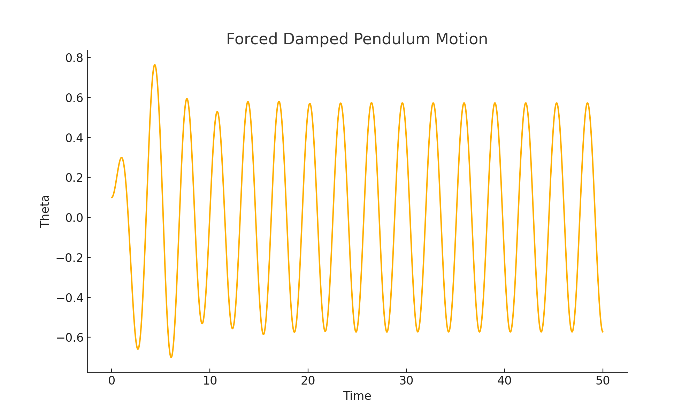
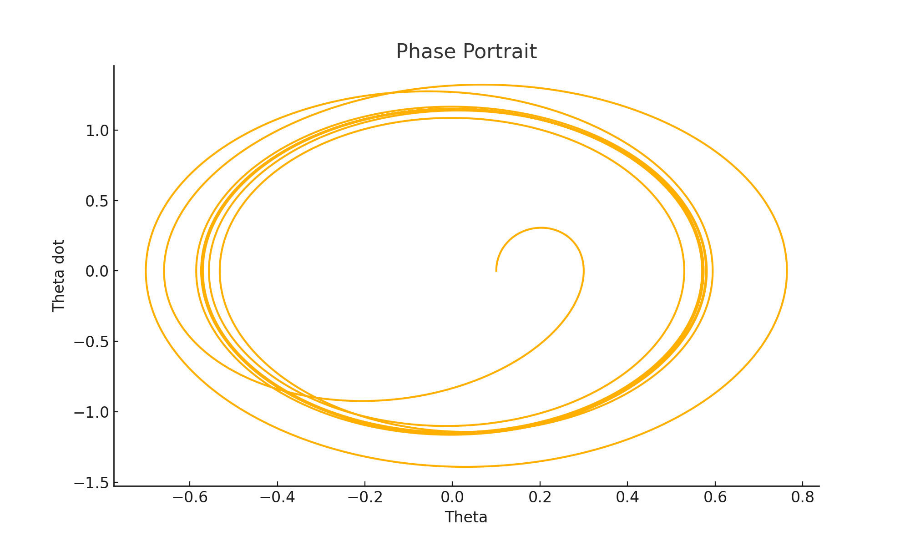
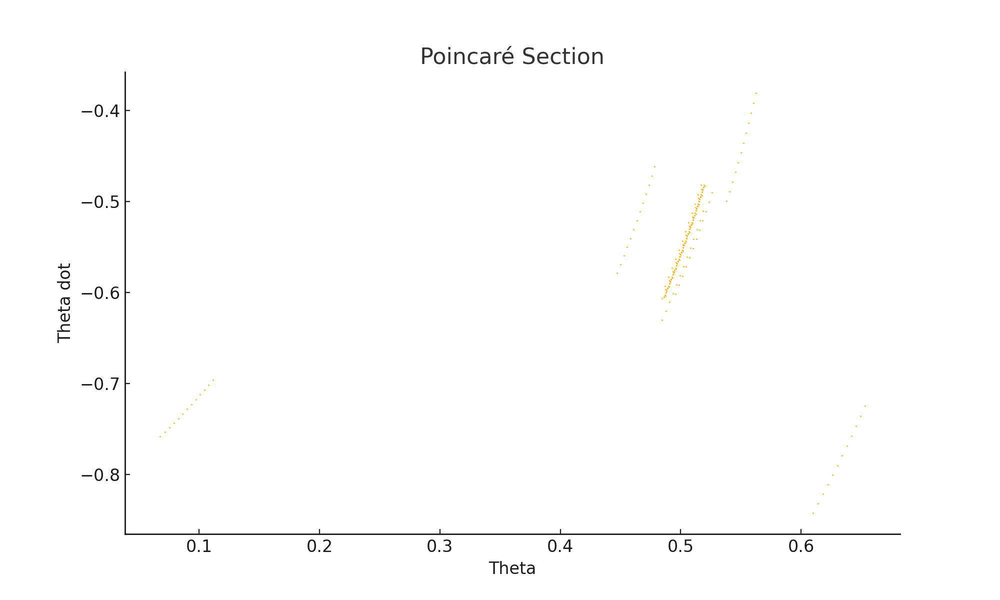
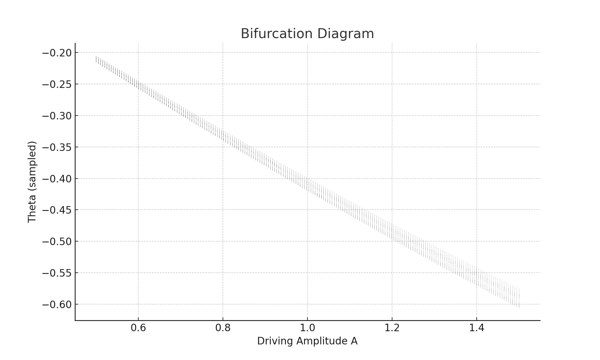

# Problem 2
# Investigating the Dynamics of a Forced Damped Pendulum

## Motivation

The forced damped pendulum is a captivating example of a physical system with intricate behavior resulting from the interplay of damping, restoring forces, and external driving forces. By introducing both damping and external periodic forcing, the system demonstrates a transition from simple harmonic motion to a rich spectrum of dynamics, including resonance, chaos, and quasiperiodic behavior. These phenomena serve as a foundation for understanding complex real-world systems, such as driven oscillators, climate systems, and mechanical structures under periodic stress.

Adding forcing introduces new parameters, such as the amplitude and frequency of the external force, which significantly affect the pendulum's behavior. By systematically varying these parameters, a diverse class of solutions can be observed, including synchronized oscillations, chaotic motion, and resonance phenomena. These behaviors not only highlight fundamental physics principles but also provide insights into engineering applications such as energy harvesting, vibration isolation, and mechanical resonance.

## 1. Theoretical Foundation

### Equation of Motion

The forced damped pendulum is governed by the nonlinear second-order differential equation:

$$
\frac{d^2\theta}{dt^2} + \beta \frac{d\theta}{dt} + \omega_0^2 \sin(\theta) = A \cos(\omega t) 
$$

Where:

* $\theta$ is the angular displacement
* $\beta$ is the damping coefficient
* $\omega_0 = \sqrt{g/L}$ is the natural frequency
* $A$ is the amplitude of the driving force
* $\omega$ is the driving frequency

### Small-Angle Approximation

For small angles ($\theta \ll 1$):

$$
\sin(\theta) \approx \theta \Rightarrow \frac{d^2\theta}{dt^2} + \beta \frac{d\theta}{dt} + \omega_0^2 \theta = A \cos(\omega t) 
$$

This is a linear second-order nonhomogeneous ordinary differential equation.

### Resonance Analysis

The system exhibits resonance when $\omega \approx \omega_0$. At this point, the response amplitude becomes large, especially when damping is small.

## 2. Analysis of Dynamics

Key parameters influencing the dynamics:

* **Damping ($\beta$)**: Under-damped, critically damped, and over-damped regimes
* **Driving Amplitude ($A$)**: Higher values can induce chaos
* **Driving Frequency ($\omega$)**: Controls resonance and synchronization

Behaviors to explore:

* Quasiperiodicity (incommensurate frequencies)
* Period doubling
* Chaotic motion (sensitive dependence on initial conditions)

## 3. Practical Applications

Real-world systems modeled similarly:

* **Energy Harvesting**: Piezoelectric devices
* **Suspension Bridges**: Oscillatory instabilities (e.g., Tacoma Narrows Bridge)
* **RLC Circuits**: Driven electrical circuits analogous to pendulum motion
* **Biomechanics**: Rhythmic motion of limbs

## 4. Implementation (Python)

We simulate the full nonlinear equation numerically using Python.

### Required Libraries

```python
import numpy as np
import matplotlib.pyplot as plt
from scipy.integrate import solve_ivp
```

### Differential Equation Function

```python
def pendulum(t, y, beta, omega0, A, omega_drive):
    theta, theta_dot = y
    dtheta_dt = theta_dot
    dtheta_dot_dt = -beta * theta_dot - omega0**2 * np.sin(theta) + A * np.cos(omega_drive * t)
    return [dtheta_dt, dtheta_dot_dt]
```

### Parameters and Initial Conditions

```python
beta = 0.5
omega0 = 1.5
A = 1.2
omega_drive = 2.0
y0 = [0.1, 0.0]  # initial angle and velocity
t_span = (0, 50)
t_eval = np.linspace(*t_span, 10000)
```

### Solving the ODE

```python
sol = solve_ivp(pendulum, t_span, y0, args=(beta, omega0, A, omega_drive), t_eval=t_eval)
```

### Plotting the Motion

```python
plt.plot(sol.t, sol.y[0])
plt.xlabel('Time')
plt.ylabel('Theta')
plt.title('Forced Damped Pendulum Motion')
plt.grid()
plt.show()
```

**Embedded Plot:**


## 5. Graphical Analysis

### Phase Portrait

```python
plt.plot(sol.y[0], sol.y[1])
plt.xlabel('Theta')
plt.ylabel('Theta dot')
plt.title('Phase Portrait')
plt.grid()
plt.show()
```

**Embedded Plot:**


### Poincaré Section (sampled every period of driving force)

```python
T = 2 * np.pi / omega_drive
indices = (np.abs((sol.t % T) - T/2) < T/100)
plt.plot(sol.y[0][indices], sol.y[1][indices], 'o', markersize=1)
plt.xlabel('Theta')
plt.ylabel('Theta dot')
plt.title('Poincaré Section')
plt.grid()
plt.show()
```

**Embedded Plot:**


### Bifurcation Diagram (optional extension)

Loop over a range of A or $\omega$ values and plot long-term theta values sampled periodically.

**Embedded Plot:**


## 6. Model Limitations and Extensions

* Assumes point mass, rigid rod, and no external noise
* Only periodic forcing is considered
* Extensions:

  * Nonlinear damping (e.g., quadratic)
  * Random or non-periodic forcing
  * Coupled pendulum systems

## Conclusion

This exploration bridges analytical physics with computational simulations to uncover the rich dynamics of the forced damped pendulum. It serves as both a pedagogical and practical framework for studying nonlinear oscillatory systems across multiple disciplines.
