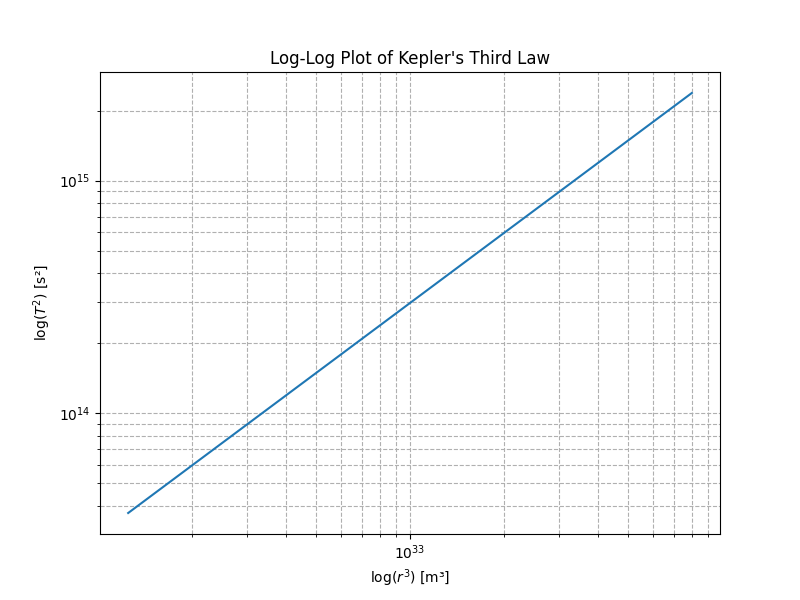

# Problem 1
# Kepler's Third Law: Orbital Period and Orbital Radius

## 1. Theoretical Derivation

Using Newton’s law of gravitation and circular motion dynamics, the gravitational force provides the centripetal force for an orbiting body:

\[
F_{\text{gravity}} = \frac{GMm}{r^2} = F_{\text{centripetal}} = \frac{mv^2}{r}
\]

This leads to:

\[
v^2 = \frac{GM}{r}
\]

The orbital period \( T \) is:

\[
T = \frac{2\pi r}{v} \implies T^2 = \frac{4 \pi^2 r^3}{GM}
\]

Thus,

\[
\boxed{T^2 \propto r^3}
\]

This is Kepler’s Third Law for circular orbits.

---

## 2. Implications for Astronomy

- Enables mass calculation of celestial bodies.
- Helps determine distances in space.
- Fundamental in satellite orbit design and exoplanet detection.

---

## 3. Real-World Examples

| Body  | Orbital Radius (m)  | Orbital Period (s) | Notes                      |
|-------|---------------------|--------------------|----------------------------|
| Moon  | \(3.84 \times 10^{8}\) | \(2.36 \times 10^{6}\)   | Orbit around Earth          |
| Earth | \(1.496 \times 10^{11}\) | \(3.16 \times 10^{7}\)   | Orbit around Sun            |
| Mars  | \(2.28 \times 10^{11}\) | \(5.93 \times 10^{7}\)   | Orbit around Sun            |

---

## 4. Graphical Representation

### Plot of \( T^2 \) vs \( r^3 \)


### Log-Log Plot of \( T^2 \) vs \( r^3 \)



---

## 5. Python Simulation Code

```python
import numpy as np
import matplotlib.pyplot as plt

G = 6.67430e-11
M = 1.989e30

radii = np.linspace(5e10, 2e11, 100)
periods_squared = [ (2 * np.pi)**2 * r**3 / (G * M) for r in radii ]

plt.plot(radii**3, periods_squared)
plt.xlabel('Orbital Radius Cubed $r^3$ (m³)')
plt.ylabel('Orbital Period Squared $T^2$ (s²)')
plt.title("Kepler's Third Law: $T^2 \\propto r^3$")
plt.grid(True)
plt.show()
