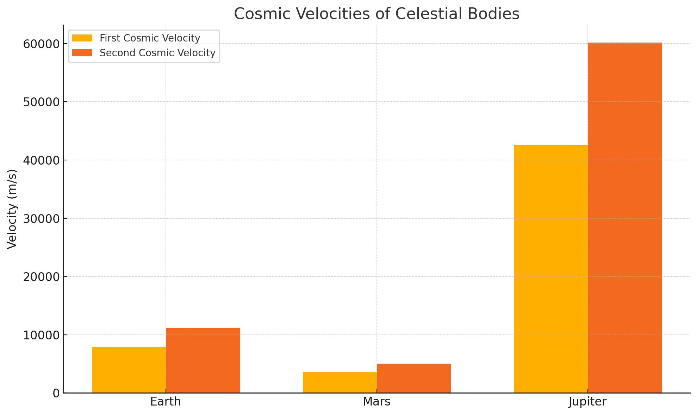

# Problem 2
# Escape Velocities and Cosmic Velocities

## Motivation

The concept of escape velocity is crucial for understanding the conditions required to leave a celestial body's gravitational influence. Extending this concept, the first, second, and third cosmic velocities define the thresholds for orbiting, escaping, and leaving a star system. These principles underpin modern space exploration, from launching satellites to interplanetary missions.

---

## Cosmic Velocities Explained

### First Cosmic Velocity (Orbital Velocity)

* The minimum velocity needed for an object to maintain a stable circular orbit just above a celestial body's surface.
* Derived from the balance of gravitational and centripetal forces.
* **Formula:**
  $v_1 = \sqrt{\frac{GM}{R}}$

### Second Cosmic Velocity (Escape Velocity)

* The minimum velocity required to escape a planet or moon's gravitational field without further propulsion.
* Based on conservation of mechanical energy.
* **Formula:**
  $v_2 = \sqrt{2} \cdot v_1 = \sqrt{\frac{2GM}{R}}$

### Third Cosmic Velocity (Heliocentric Escape Velocity)

* The velocity required to escape the gravitational influence of a star (e.g., the Sun).
* Depends on the orbital velocity of the planet around the star.
* **Formula (approximate):**
  $v_3 = \sqrt{2} \cdot v_{orbital\_planet}$

---

## Mathematical Derivation

From conservation of energy:

* Total Energy = Kinetic Energy + Potential Energy

For escape velocity:
$\frac{1}{2}mv^2 - \frac{GMm}{R} = 0 \Rightarrow v = \sqrt{\frac{2GM}{R}}$

Where:

* $G$ is the gravitational constant: $6.67430 \times 10^{-11} \ \text{m}^3\text{kg}^{-1}\text{s}^{-2}$
* $M$ is the mass of the celestial body
* $R$ is the radius of the body

---

## Python Simulation

```python
import numpy as np
import matplotlib.pyplot as plt

# Constants
G = 6.67430e-11  # Gravitational constant

# Celestial Bodies (Mass in kg, Radius in m)
bodies = {
    "Earth": {"mass": 5.972e24, "radius": 6.371e6},
    "Mars": {"mass": 6.417e23, "radius": 3.3895e6},
    "Jupiter": {"mass": 1.898e27, "radius": 6.9911e7}
}

def first_cosmic_velocity(M, R):
    return np.sqrt(G * M / R)

def second_cosmic_velocity(M, R):
    return np.sqrt(2 * G * M / R)

# Data collection
first_vels = []
second_vels = []
labels = []

for name, data in bodies.items():
    M = data["mass"]
    R = data["radius"]
    v1 = first_cosmic_velocity(M, R)
    v2 = second_cosmic_velocity(M, R)

    labels.append(name)
    first_vels.append(v1)
    second_vels.append(v2)

# Visualization
x = np.arange(len(labels))
width = 0.35

plt.figure(figsize=(10, 6))
plt.bar(x - width/2, first_vels, width, label='First Cosmic Velocity')
plt.bar(x + width/2, second_vels, width, label='Second Cosmic Velocity')
plt.xticks(x, labels)
plt.ylabel("Velocity (m/s)")
plt.title("Cosmic Velocities of Celestial Bodies")
plt.legend()
plt.grid(True, linestyle='--', alpha=0.6)
plt.tight_layout()
plt.show()
```

---

## Applications in Space Exploration

### Satellite Launching

* Requires achieving the first cosmic velocity for stable orbits.

### Interplanetary Missions

* Spacecraft must reach at least the second cosmic velocity to leave Earth's gravity.

### Interstellar Travel

* Requires third cosmic velocity to escape the Solar System.
* Potential future propulsion methods: ion drives, nuclear propulsion, solar sails.

---

## Conclusion

Understanding cosmic velocities is foundational to space exploration. From orbiting satellites to escaping planetary systems, these concepts guide engineering, mission planning, and future interstellar ambitions.

---

## References

* NASA Planetary Fact Sheet
* Fundamentals of Astrodynamics by Bate, Mueller, and White
* Open-source tools: NumPy, Matplotlib
