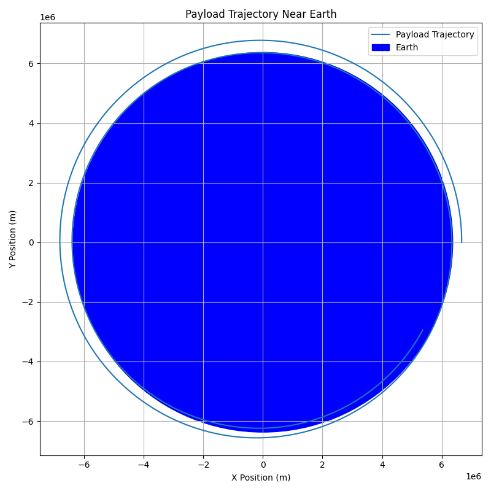
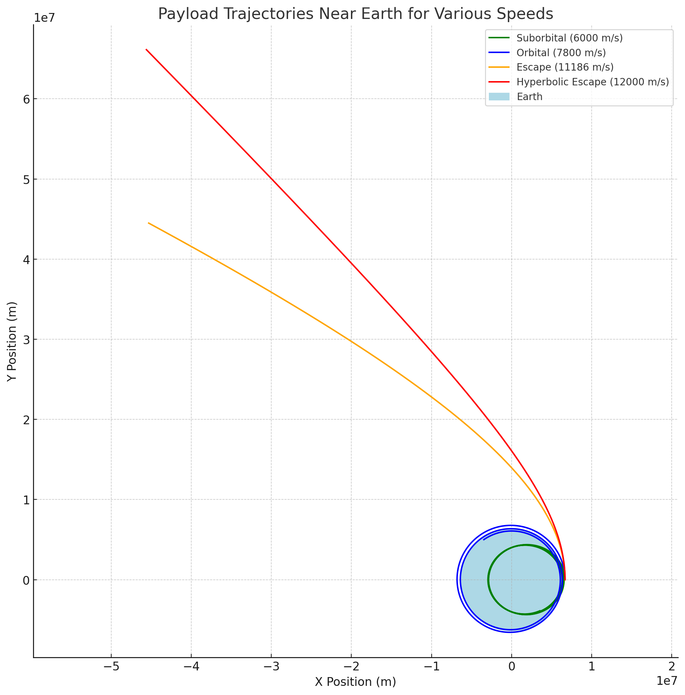
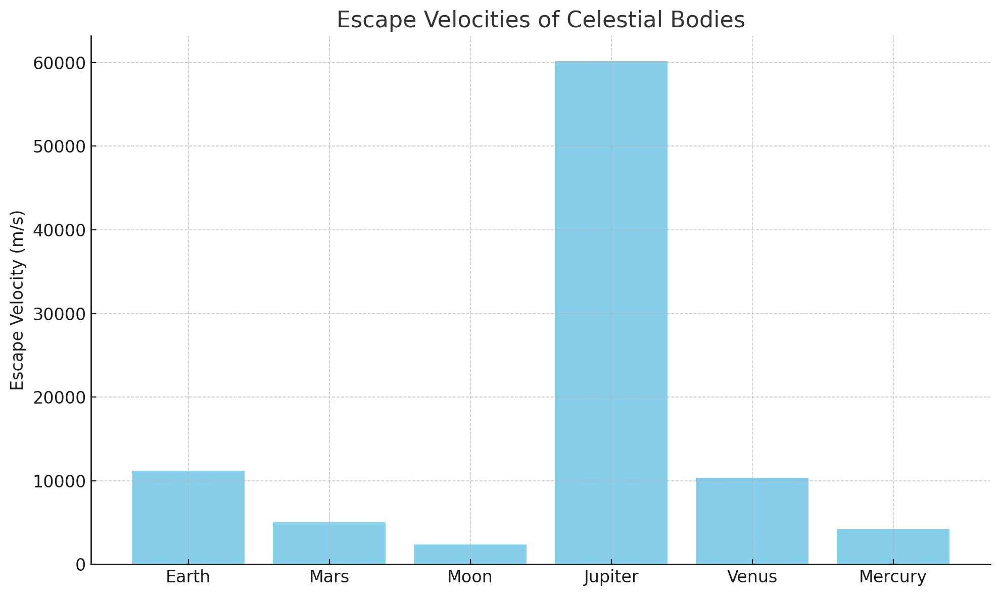

# Problem 3
# Trajectories of a Freely Released Payload Near Earth

## Motivation

When an object is released from a moving rocket near Earth, its trajectory depends on initial conditions and gravitational forces. This scenario blends principles of orbital mechanics and numerical simulation. Understanding the possible trajectories is vital for space missions, such as satellite deployment, orbital insertion, and controlled reentry.

---

## Types of Trajectories

* **Elliptical Orbit (0 < e < 1):** The payload remains in a stable orbit.
* **Parabolic Trajectory (e = 1):** The payload reaches escape velocity and moves away indefinitely.
* **Hyperbolic Trajectory (e > 1):** The payload exceeds escape velocity and escapes Earth's gravity.
* **Suborbital Trajectory:** Not enough speed to maintain orbit; reenters Earth's atmosphere.

---

## Physical Background

### Newton's Law of Gravitation

$$
F = \frac{GMm}{r^2}
$$

### Equation of Motion (2D)

Given a position $(x, y)$ and velocity $(v_x, v_y)$:

$$
\vec{a} = -\frac{GM}{r^3} \cdot \vec{r}
$$

### Total Energy

$$
E = \frac{1}{2}mv^2 - \frac{GMm}{r}
$$

* If $E < 0$: Bound elliptical orbit.
* If $E = 0$: Parabolic trajectory.
* If $E > 0$: Hyperbolic escape.

---

## Python Simulation

```python
import numpy as np
import matplotlib.pyplot as plt
from scipy.integrate import solve_ivp

G = 6.67430e-11
M = 5.972e24  # Earth's mass (kg)
R = 6.371e6   # Earth's radius (m)

def gravity(t, y):
    rx, ry, vx, vy = y
    r = np.sqrt(rx**2 + ry**2)
    ax = -G * M * rx / r**3
    ay = -G * M * ry / r**3
    return [vx, vy, ax, ay]

# Initial conditions
altitude = 300e3  # 300 km
speed = 7800      # near orbital velocity (m/s)
angle = np.radians(0)

x0, y0 = R + altitude, 0
vx0 = 0
vy0 = speed

y_init = [x0, y0, vx0, vy0]
t_span = (0, 10000)
t_eval = np.linspace(*t_span, 1000)

sol = solve_ivp(gravity, t_span, y_init, t_eval=t_eval)

plt.figure(figsize=(8, 8))
plt.plot(sol.y[0], sol.y[1], label='Payload Trajectory')
circle = plt.Circle((0, 0), R, color='blue', label='Earth')
plt.gca().add_patch(circle)
plt.xlabel('X Position (m)')
plt.ylabel('Y Position (m)')
plt.title('Payload Trajectory Near Earth')
plt.axis('equal')
plt.grid(True)
plt.legend()
plt.tight_layout()
plt.savefig("payload_trajectory.png")
plt.show()
# Constants and gravity function reused from above
speeds = [6000, 7800, np.sqrt(2 * G * M / R), 12000]
labels = ["Suborbital", "Orbital", "Escape", "Hyperbolic Escape"]
colors = ["green", "blue", "orange", "red"]

plt.figure(figsize=(10, 10))
for v, label, color in zip(speeds, labels, colors):
    vx0 = 0
    vy0 = v
    y_init = [x0, y0, vx0, vy0]
    sol = solve_ivp(gravity, (0, 12000), y_init, t_eval=np.linspace(0, 12000, 3000))
    plt.plot(sol.y[0], sol.y[1], label=f"{label} ({v:.0f} m/s)", color=color)

earth = plt.Circle((0, 0), R, color='lightblue', label='Earth')
plt.gca().add_patch(earth)
plt.xlabel("X Position (m)")
plt.ylabel("Y Position (m)")
plt.title("Payload Trajectories Near Earth for Various Speeds")
plt.axis('equal')
plt.grid(True)
plt.legend()
plt.tight_layout()
plt.savefig("payload_trajectories_comparison.png")
plt.show()
bodies = {
    "Earth": {"mass": 5.972e24, "radius": 6.371e6},
    "Mars": {"mass": 6.417e23, "radius": 3.3895e6},
    "Moon": {"mass": 7.347e22, "radius": 1.737e6},
    "Jupiter": {"mass": 1.898e27, "radius": 6.9911e7},
    "Venus": {"mass": 4.867e24, "radius": 6.052e6},
    "Mercury": {"mass": 3.285e23, "radius": 2.4397e6}
}

escape_velocities = {}
for body, data in bodies.items():
    M = data["mass"]
    R = data["radius"]
    v_esc = np.sqrt(2 * G * M / R)
    escape_velocities[body] = v_esc

plt.figure(figsize=(10, 6))
plt.bar(escape_velocities.keys(), escape_velocities.values(), color='skyblue')
plt.ylabel("Escape Velocity (m/s)")
plt.title("Escape Velocities of Celestial Bodies")
plt.grid(axis='y', linestyle='--', alpha=0.7)
plt.tight_layout()
plt.savefig("escape_velocities.png")
plt.show()
```

---

## Graphical Representations






---

## Applications in Space Missions

* **Orbital Insertion:** Achieving stable elliptical or circular trajectories.
* **Controlled Reentry:** Releasing below orbital speed for atmospheric return.
* **Escape Missions:** Providing enough energy for parabolic or hyperbolic paths.

---

## Conclusion

This study of payload trajectories helps understand the critical velocities and directions needed for different mission outcomes. Through Newtonian gravity and numerical methods, we can predict whether a released object will orbit, crash, or escape.

---

## References

* NASA Basics of Space Flight
* Fundamentals of Astrodynamics, Bate et al.
* Python libraries: NumPy, SciPy, Matplotlib
