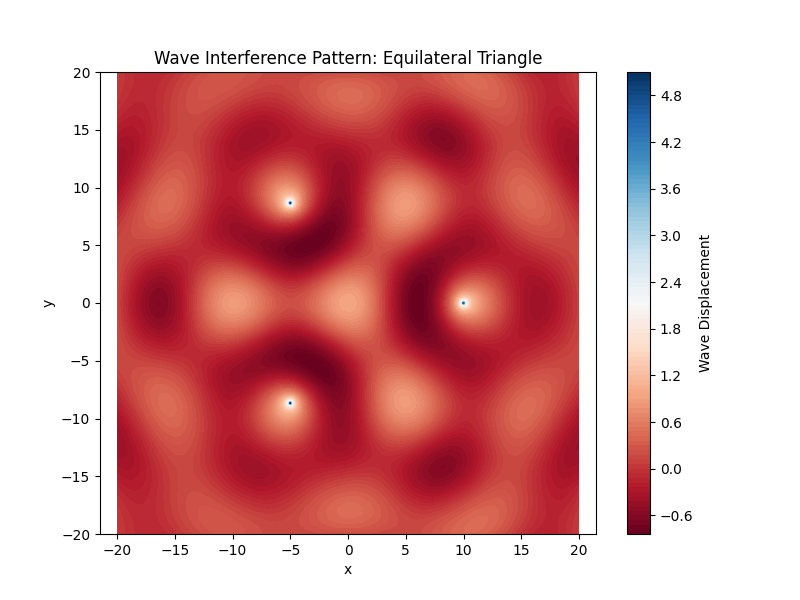
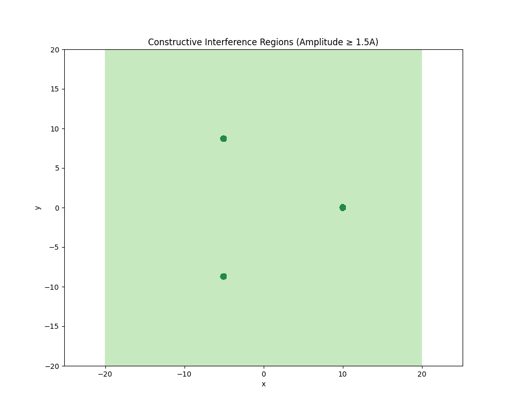
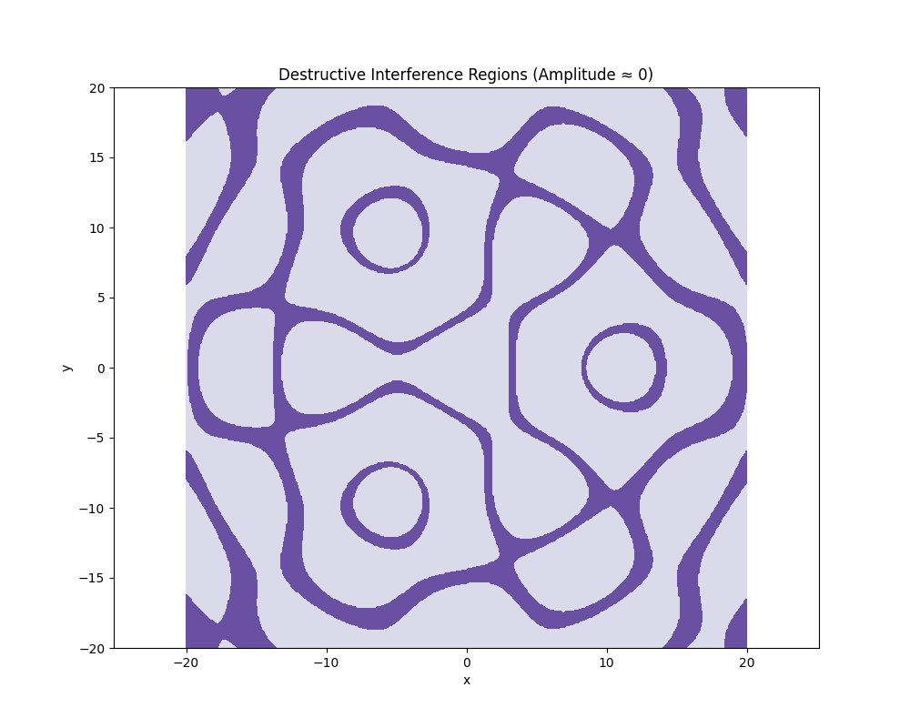

# Problem 1
# 🌊 Wave Interference Simulation Using Regular Polygons

## 📌 Problem Statement
This simulation analyzes the interference patterns formed on the water surface due to the superposition of waves emitted from point sources placed at the vertices of a regular polygon (triangle, square, or pentagon).

---

## 📐 Geometry and Wave Setup

### Regular Polygon: Equilateral Triangle

### Parameters:
- Amplitude (A): 1.0
- Wavelength (λ): 10.0 units
- Frequency (f): 1.0 Hz
- Phase (ϕ): 0
- Wave speed (v): 10.0 units/s
- Domain: 2D grid from -20 to 20 units

---

## 📈 Mathematical Formulation

### Single Point Source Wave:
\[
\eta(x, y, t) = \frac{A}{\sqrt{r}} \cos(kr - \omega t + \phi)
\]

### Multiple Sources (Superposition):
\[
\eta_{\text{sum}}(x, y, t) = \sum_{n=1}^{N} \eta_n(x, y, t)
\]

Where:
- \( A \): Amplitude
- \( k = \frac{2\pi}{\lambda} \): Wave number
- \( \omega = 2\pi f \): Angular frequency
- \( r \): Distance from source to point
- \( \phi \): Phase

---

## ⚙️ Python Simulation Code

```python
import numpy as np
import matplotlib.pyplot as plt

# Parameters
A = 1.0
wavelength = 10.0
f = 1.0
phi = 0
v = 10.0

k = 2 * np.pi / wavelength
omega = 2 * np.pi * f

# Time
t = 0

# Define the vertices of an equilateral triangle
def get_polygon_vertices(n, radius=10):
    return [(radius * np.cos(2 * np.pi * i / n),
             radius * np.sin(2 * np.pi * i / n)) for i in range(n)]

sources = get_polygon_vertices(3)

# Grid
x = np.linspace(-20, 20, 500)
y = np.linspace(-20, 20, 500)
X, Y = np.meshgrid(x, y)

# Superposition
eta_total = np.zeros_like(X)
for (x0, y0) in sources:
    r = np.sqrt((X - x0)**2 + (Y - y0)**2)
    eta = (A / np.sqrt(r + 1e-6)) * np.cos(k * r - omega * t + phi)
    eta_total += eta

# Plotting
plt.figure(figsize=(8, 6))
plt.contourf(X, Y, eta_total, cmap='RdBu', levels=100)
plt.colorbar(label='Wave Displacement')
plt.title('Wave Interference Pattern: Equilateral Triangle')
plt.xlabel('x')
plt.ylabel('y')
plt.axis('equal')
plt.show()
```

## Graphical Representations



## 🔍 Observations

- **Constructive Interference**: Occurs when wave peaks overlap — leading to amplified regions.
- **Destructive Interference**: Occurs when a peak meets a trough — leading to cancellation zones.
- The symmetry of the equilateral triangle leads to a repeating, radially symmetric interference pattern.

---

## 📌 Conclusion

This simulation demonstrates how wave interference patterns emerge from point sources placed symmetrically in a polygon. This forms a rich visual display of fundamental wave phenomena like superposition, constructive and destructive interference.
