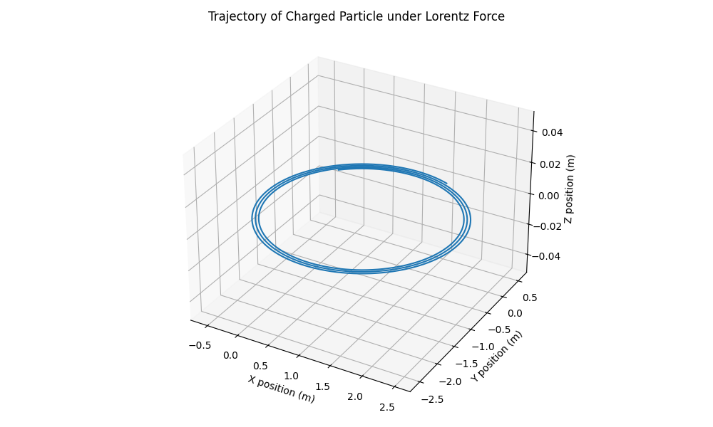
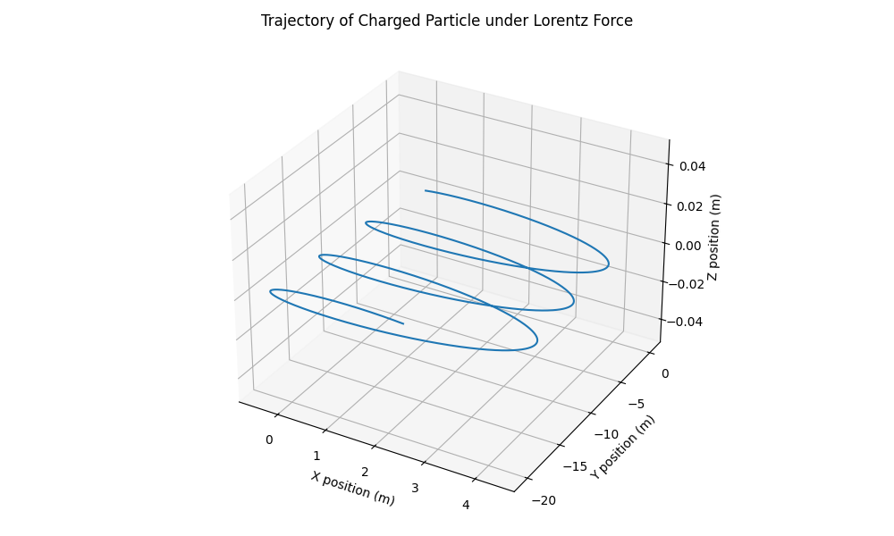

# Problem 1
# Lorentz Force Simulation Project

## 1. Exploration of Applications

### Key Systems Affected by the Lorentz Force:

* **Particle Accelerators**: Use electromagnetic fields to accelerate and steer particles.
* **Mass Spectrometers**: Separate ions based on mass-to-charge ratio using electric and magnetic fields.
* **Plasma Confinement (Tokamaks)**: Use magnetic fields to confine hot plasma in fusion reactors.
* **Cathode Ray Tubes**: Deflect electron beams using magnetic and electric fields.
* **Auroras**: Charged particles from the sun spiral along Earth's magnetic field lines.

### Role of Fields:

* **Electric Fields ($\vec{E}$)**: Accelerate or decelerate particles in the direction of the field.
* **Magnetic Fields ($\vec{B}$)**: Curve the motion of particles, inducing circular or helical paths due to the perpendicular force $\vec{F}_B = q\vec{v} \times \vec{B}$).

---

## 2. Simulating Particle Motion

### Lorentz Force Equation:

$\vec{F} = q(\vec{E} + \vec{v} \times \vec{B})$

### Python Implementation:

```python
import numpy as np
import matplotlib.pyplot as plt
from mpl_toolkits.mplot3d import Axes3D

# Constants and Parameters
q = 1.0                 # Charge of the particle (C)
m = 1.0                 # Mass of the particle (kg)
E = np.array([0.0, 0.0, 0.0])   # Electric field vector (V/m)
B = np.array([0.0, 0.0, 1.0])   # Magnetic field vector (T)
v = np.array([1.0, 1.0, 0.0])   # Initial velocity vector (m/s)
r = np.array([0.0, 0.0, 0.0])   # Initial position vector (m)

dt = 0.01              # Time step (s)
T = 20.0               # Total time (s)
steps = int(T / dt)    # Number of time steps

# Arrays to store trajectory
trajectory = np.zeros((steps, 3))

# Time evolution
for i in range(steps):
    F = q * (E + np.cross(v, B))
    a = F / m
    v = v + a * dt
    r = r + v * dt
    trajectory[i] = r

# Visualization in 3D
fig = plt.figure(figsize=(10, 6))
ax = fig.add_subplot(111, projection='3d')
ax.plot(trajectory[:, 0], trajectory[:, 1], trajectory[:, 2])
ax.set_title('Trajectory of Charged Particle under Lorentz Force')
ax.set_xlabel('X position (m)')
ax.set_ylabel('Y position (m)')
ax.set_zlabel('Z position (m)')
plt.tight_layout()
plt.show()

# Compute and print Larmor radius
v_perp = np.linalg.norm(np.cross(v, B) / np.linalg.norm(B))
r_L = m * v_perp / (abs(q) * np.linalg.norm(B))
print(f"Larmor Radius: {r_L:.4f} m")
# Constants and Parameters
q = 1.0                 # Charge of the particle (C)
m = 1.0                 # Mass of the particle (kg)
E = np.array([1.0, 0.0, 0.0])   # Electric field vector (V/m)
B = np.array([0.0, 0.0, 1.0])   # Magnetic field vector (T)
v = np.array([1.0, 1.0, 0.0])   # Initial velocity vector (m/s)
r = np.array([0.0, 0.0, 0.0])   # Initial position vector (m)

dt = 0.01              # Time step (s)
T = 20.0               # Total time (s)
steps = int(T / dt)    # Number of time steps

# Arrays to store trajectory
trajectory = np.zeros((steps, 3))

# Time evolution
for i in range(steps):
    F = q * (E + np.cross(v, B))
    a = F / m
    v = v + a * dt
    r = r + v * dt
    trajectory[i] = r

# Visualization in 3D
fig = plt.figure(figsize=(10, 6))
ax = fig.add_subplot(111, projection='3d')
ax.plot(trajectory[:, 0], trajectory[:, 1], trajectory[:, 2])
ax.set_title('Trajectory of Charged Particle under Lorentz Force')
ax.set_xlabel('X position (m)')
ax.set_ylabel('Y position (m)')
ax.set_zlabel('Z position (m)')
plt.tight_layout()
plt.show()

# Compute and print Larmor radius
v_cross_B = np.cross(v, B)
v_perp = np.linalg.norm(v_cross_B) / np.linalg.norm(B)
r_L = m * v_perp / (abs(q) * np.linalg.norm(B))
print(f"Larmor Radius: {r_L:.4f} m")

# Compute and print E x B drift velocity
v_drift = np.cross(E, B) / np.linalg.norm(B)**2
print(f"E x B Drift Velocity: {v_drift}")
```

---

## 3. Parameter Exploration

Allow user to adjust:

* Electric and Magnetic field strengths ($\vec{E}, \vec{B}$)
* Initial velocity vector ($\vec{v}$)
* Particle charge ($q$) and mass ($m$)

Use `ipywidgets` for interactive sliders if working in Jupyter Notebook.

---

## 4. Visualization


### Phenomena to Highlight:

* **Larmor Radius**:
  $r_L = \frac{mv_\perp}{|q|B}$

* **Helical Motion**: Spiral paths when there’s velocity along the direction of $\vec{B}$.

* **$\vec{E} \times \vec{B}$** Drift:
  $\vec{v}_d = \frac{\vec{E} \times \vec{B}}{B^2}$

### Plotting Tips:

* Top-down (XY) view for circular motion.
* 3D plots for helical motion.
* Compare paths under different $\vec{E}$ and $\vec{B}$ settings.

---

## Conclusion

This simulation provides hands-on insight into how charged particles respond to electric and magnetic fields. It can be extended to multiple particles, more complex field configurations, or even relativistic speeds.

---

