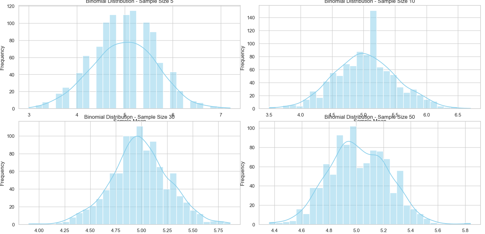
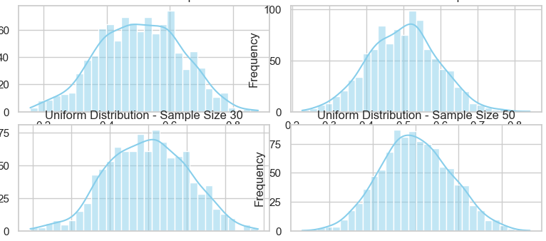
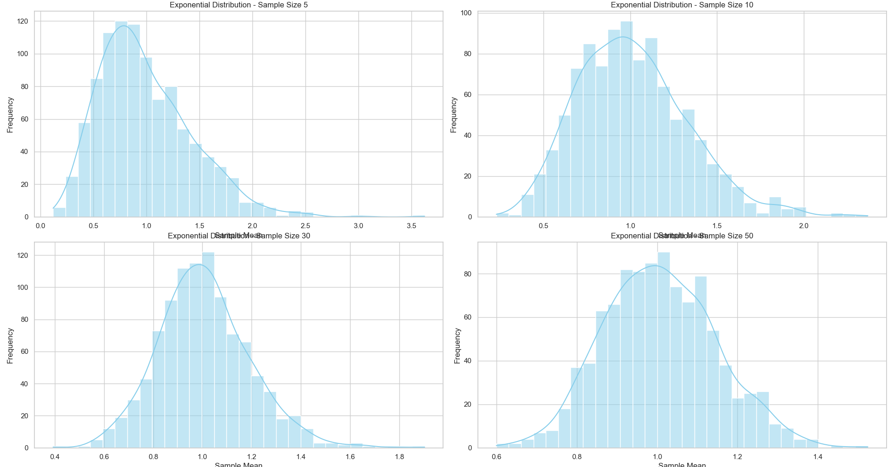

# Problem 1
# Exploring the Central Limit Theorem through Simulations

## Motivation

The Central Limit Theorem (CLT) is a foundational concept in statistics, stating that the sampling distribution of the sample mean tends toward a normal distribution as the sample size increases, regardless of the original population distribution. This project uses simulations to illustrate and explore the CLT.

---

## 1. Simulating Sampling Distributions

### Population Distributions

We used three types of distributions to simulate populations of size 100,000:

* **Uniform distribution**: Values between 0 and 1.
* **Exponential distribution**: Mean = 1.0.
* **Binomial distribution**: Parameters n=10, p=0.5.

```python
uniform_pop = np.random.uniform(0, 1, 100_000)
exponential_pop = np.random.exponential(scale=1.0, size=100_000)
binomial_pop = np.random.binomial(n=10, p=0.5, size=100_000)
```

---

## 2. Sampling and Visualization

### Method

For each population, we:

* Drew samples of sizes 5, 10, 30, and 50.
* Repeated sampling 1,000 times.
* Calculated the sample mean each time.
* Plotted the sampling distribution of the sample means.

```python
sample_means = [np.mean(np.random.choice(population, size=n, replace=False)) for _ in range(1000)]
```

### Visualizations

Plots showed how the sample mean distributions became increasingly bell-shaped and symmetric with larger sample sizes, especially for skewed populations like exponential.

---

## 3. Parameter Exploration

### Rate of Convergence

* **Uniform and binomial distributions**: Rapid convergence to normality even at n=10.
* **Exponential distribution**: Slower convergence; more sample size needed to observe normality due to high skewness.

### Spread of Distributions

* The spread (standard deviation) of the sampling distributions decreased with increasing sample size.
* Variance of the sampling distribution is approximately $\frac{\sigma^2}{n}$, aligning with CLT predictions.

---
## Python Script 
```Python
import numpy as np
import matplotlib.pyplot as plt
import seaborn as sns

# Set seaborn style
sns.set(style="whitegrid")
np.random.seed(42)

# Population size
population_size = 100_000

# Generate populations
uniform_pop = np.random.uniform(0, 1, population_size)
exponential_pop = np.random.exponential(scale=1.0, size=population_size)
binomial_pop = np.random.binomial(n=10, p=0.5, size=population_size)

# Sample sizes to test
sample_sizes = [5, 10, 30, 50]
num_samples = 1000  # number of repetitions

# Plotting function
def plot_sampling_distribution(population, sample_sizes, num_samples, dist_name):
    plt.figure(figsize=(20, 16))
    for i, size in enumerate(sample_sizes, 1):
        sample_means = [
            np.mean(np.random.choice(population, size=size, replace=False))
            for _ in range(num_samples)
        ]
        plt.subplot(2, 2, i)
        sns.histplot(sample_means, bins=30, kde=True, color='skyblue')
        plt.title(f'{dist_name} Distribution - Sample Size {size}')
        plt.xlabel('Sample Mean')
        plt.ylabel('Frequency')
    plt.tight_layout()
    plt.show()

# Run simulations
print("Sampling from Uniform Distribution")
plot_sampling_distribution(uniform_pop, sample_sizes, num_samples, "Uniform")

print("Sampling from Exponential Distribution")
plot_sampling_distribution(exponential_pop, sample_sizes, num_samples, "Exponential")

print("Sampling from Binomial Distribution")
plot_sampling_distribution(binomial_pop, sample_sizes, num_samples, "Binomial")
```
## Graphs



## 4. Practical Applications

### Estimating Population Parameters

* CLT justifies the use of sample means to estimate population means with confidence intervals.

### Quality Control

* Helps detect defects by analyzing means of product samples rather than full population testing.

### Financial Modeling

* Supports risk assessment through aggregate modeling of returns and investments.

---

## Conclusion

This simulation-based exploration validates the Central Limit Theorem. Regardless of the original population's shape, the distribution of sample means tends toward normality as sample size increases. This behavior is essential in statistical inference, making the CLT a powerful and practical tool across many disciplines.

---

## Tools Used

* Python
* NumPy
* Matplotlib
* Seaborn