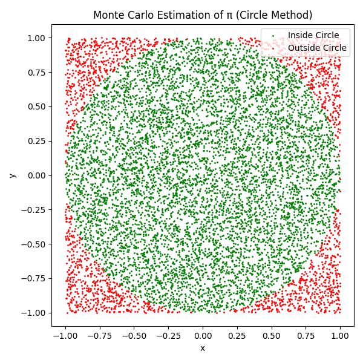

# Problem 2
# Estimating Pi Using Monte Carlo Methods

## Motivation

Monte Carlo simulations leverage randomness to solve mathematical problems through repeated random sampling. A classic and elegant example is estimating the value of $\pi$. This project explores two Monte Carlo approaches to estimate $\pi$: using a unit circle within a square and using Buffon’s Needle experiment. These simulations not only demonstrate the power of randomness but also bridge concepts from geometry, probability, and numerical computation.

---

## Part 1: Estimating $\pi$ Using a Circle

### 1. Theoretical Foundation

A circle with radius 1 (unit circle) fits perfectly inside a square of side length 2. The area of the circle is:

$A_{circle} = \pi r^2 = \pi \cdot 1^2 = \pi$

The area of the square is:

$A_{square} = (2r)^2 = 4$

If we randomly generate points within the square, the ratio of points inside the circle to the total number of points approximates:

$\frac{\text{Points in Circle}}{\text{Total Points}} \approx \frac{\pi}{4} \Rightarrow \pi \approx 4 \cdot \frac{\text{Points in Circle}}{\text{Total Points}}$

### 2. Simulation

```python
import numpy as np
import matplotlib.pyplot as plt

# Parameters
num_points = 10000
inside_circle = 0

x_points = np.random.uniform(-1, 1, num_points)
y_points = np.random.uniform(-1, 1, num_points)

# Distance from origin
distances = x_points**2 + y_points**2
inside_circle = distances <= 1

# Estimate Pi
pi_estimate = 4 * np.sum(inside_circle) / num_points
print(f"Estimated pi (circle method): {pi_estimate}")
```

### 3. Visualization

```python
plt.figure(figsize=(6, 6))
plt.scatter(x_points[inside_circle], y_points[inside_circle], color='green', s=1, label='Inside Circle')
plt.scatter(x_points[~inside_circle], y_points[~inside_circle], color='red', s=1, label='Outside Circle')
plt.title("Monte Carlo Estimation of Pi (Circle Method)")
plt.xlabel("x")
plt.ylabel("y")
plt.legend()
plt.gca().set_aspect('equal')
plt.show()
```

### 4. Analysis

* Accuracy improves as number of points increases.
* Convergence is proportional to $1/\sqrt{n}$.
* Simple and efficient but has slow convergence rate.

---

## Part 2: Estimating $\pi$ Using Buffon’s Needle

### 1. Theoretical Foundation

In Buffon’s Needle problem, a needle of length $L$ is dropped on a plane with parallel lines spaced $D$ units apart ($L \leq D$). The probability $P$ of the needle crossing a line is:

$P = \frac{2L}{\pi D} \Rightarrow \pi \approx \frac{2L \cdot N}{D \cdot C}$

Where:

* $N$ is the total number of drops.
* $C$ is the number of times the needle crosses a line.

### 2. Simulation

```python
# Parameters
needle_length = 1.0
line_spacing = 2.0
num_drops = 10000

# Generate needle midpoints and angles
x_midpoints = np.random.uniform(0, line_spacing / 2, num_drops)
theta = np.random.uniform(0, np.pi / 2, num_drops)

# Check if the needle crosses a line
crosses = x_midpoints <= (needle_length / 2) * np.sin(theta)

# Estimate Pi
pi_buffon = (2 * needle_length * num_drops) / (line_spacing * np.sum(crosses))
print(f"Estimated pi (Buffon's Needle): {pi_buffon}")
```

### 3. Visualization

```python
plt.figure(figsize=(8, 6))
for i in range(200):
    x_center = x_midpoints[i]
    angle = theta[i]
    x1 = x_center - (needle_length / 2) * np.cos(angle)
    x2 = x_center + (needle_length / 2) * np.cos(angle)
    y1 = i % 5
    y2 = y1
    plt.plot([x1, x2], [y1, y2], color='blue' if crosses[i] else 'gray', linewidth=1)

# Draw parallel lines
for y in range(6):
    plt.axhline(y, color='black', linewidth=0.5)

plt.title("Buffon's Needle Simulation")
plt.xlabel("x")
plt.ylabel("y")
plt.show()
```

### 4. Analysis

* Convergence is slower and noisier than the circle method.
* Sensitive to low crossing counts; requires large sample sizes.
* Offers an interesting physical and probabilistic connection to $\pi$.

---

## Comparison & Conclusion

| Method          | Sample Size | Estimated $\pi$ | Convergence Rate | Complexity |
| --------------- | ----------- | --------------- | ---------------- | ---------- |
| Circle-Based    | 10,000      | \~3.14          | $1/\sqrt{n}$     | Low        |
| Buffon’s Needle | 10,000      | \~3.13–3.16     | Slower           | Medium     |

Monte Carlo methods demonstrate how randomness can approximate fundamental constants like $\pi$. While the circle method is easier and converges faster, Buffon’s Needle highlights deeper geometric and probabilistic insights. These simulations lay a foundation for using randomness in scientific and computational applications.

---

## Tools Used

* Python
* NumPy
* Matplotlib
